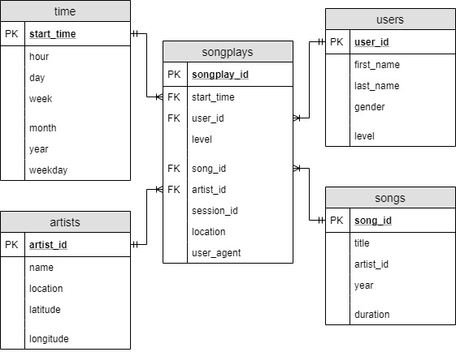

# Data Modeling and Analytics with SQL Server, dbt, and Vanna


### Project Description

This project builds a scalable analytics solution for **Sparkily**, a music streaming service that wants to analyze song metadata and user activity data. The core components include:

* **SQL Server** as the central data warehouse.
* **dbt (data build tool)** to transform and model the raw data into analytics-ready tables.
* **Vanna.AI** to provide a natural language interface for business users to interact with the data.
***

***
Sparkily collects JSON-formatted logs for both user activity and song metadata. These logs are transformed into structured tables that provide insights into user listening behavior.

---

### Datasets

Sparkily integrates two datasets:

1. **Song Dataset**
   JSON files containing metadata about songs and their respective artists. The files are partitioned by the first three letters of each song’s track ID.
   Example path:

   ```
   song_data/A/A/B/TRAABJL12903CDCF1A.json
   ```

   Sample content:

   ```json
   {
     "num_songs": 1,
     "artist_id": "ARJIE2Y1187B994AB7",
     "artist_latitude": null,
     "artist_longitude": null,
     "artist_location": "",
     "artist_name": "Line Renaud",
     "song_id": "SOUPIRU12A6D4FA1E1",
     "title": "Der Kleine Dompfaff",
     "duration": 152.92036,
     "year": 0
   }
   ```

2. **Log Dataset**
   JSON event logs simulating user interactions within the app. The data is partitioned by year and month.
   Example path:

   ```
   log_data/2018/11/2018-11-12-events.json
   ```

---

### Initial Setup

1. **Clone the repository**

   ```bash
   git clone https://github.com/remitpro/sparkily.git
   cd sparkily
   ```

2. **Load raw data into SQL Server**

   Modify and run the `etl.py` script to extract JSON logs and load the raw data into SQL Server staging tables.

3. **Transform data using dbt**

   * Initialize and configure your `dbt` project to connect to your SQL Server instance.
   * Define models to transform raw data into analytics-ready tables (fact and dimension tables).
   * Run dbt:

     ```bash
     dbt run
     ```

4. **Enable natural language querying with Vanna.AI**

   * Connect Vanna.AI to your SQL Server database.
   * Configure your schema and define metadata so users can ask questions like:

     * *“What songs were played most in November 2018?”*
     * *“Which users listened to artist X?”*
   * Vanna.AI translates natural language into SQL queries automatically.

---

### Database Schema (modeled via dbt)

After transformations, the following analytics-ready schema is created in SQL Server:

* `fact_songplays`
* `dim_users`
* `dim_songs`
* `dim_artists`
* `dim_time`



---

### Sample SQL Query

The database enables the analytics team to understand listening behavior. For example:

```sql
SELECT 
    f.user_agent,
    u.first_name,
    u.last_name,
    s.title,
    s.duration,
    a.name AS artist_name
FROM fact_songplays f
JOIN dim_users u ON f.user_id = u.user_id
JOIN dim_songs s ON f.song_id = s.song_id
JOIN dim_artists a ON f.artist_id = a.artist_id
```

---

### Summary

* **SQL Server**: Storage and performance at scale
* **dbt**: Automated and version-controlled data transformation
* **Vanna.AI**: Accessible analytics through natural language

This setup empowers Sparkily's data and analytics team to derive actionable insights from their raw music and user activity logs with ease.

---

